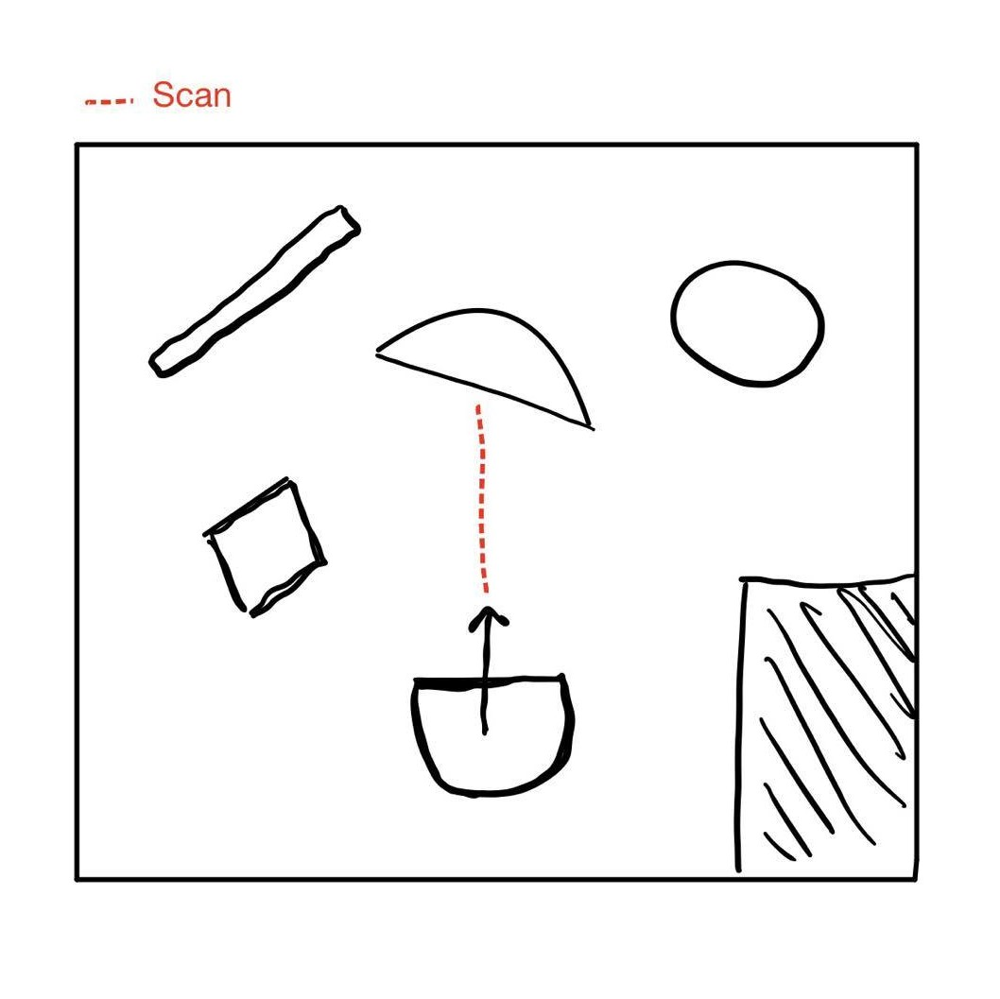
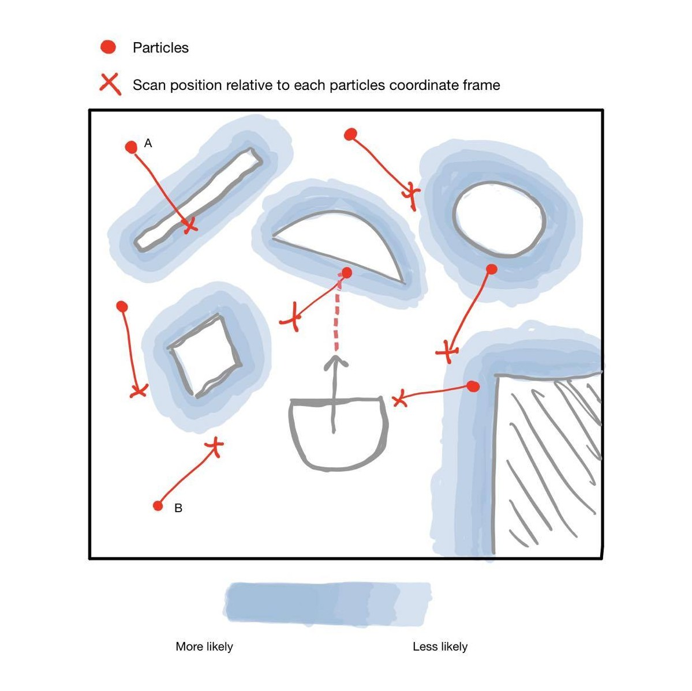
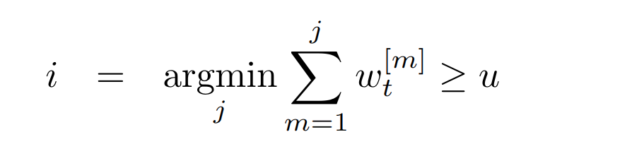
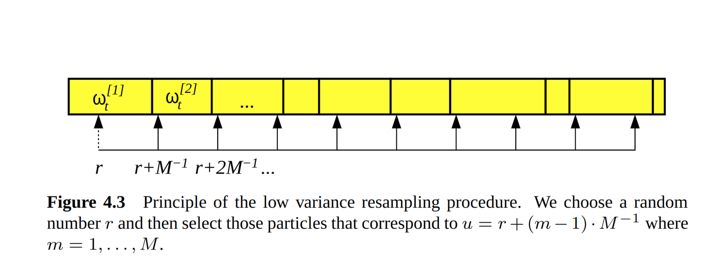
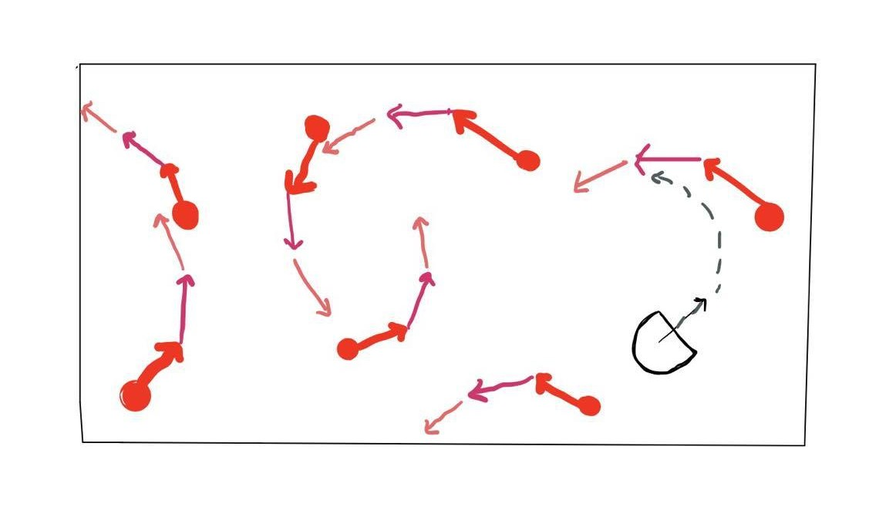

# CompRobo:  Robot Localization
Anna Griffin, Sherrie Shen  
October 21, 2020

 

## Introduction
Determining where a robot is relative to its environment is a very important yet a challenging problem to solve. One way to go about localizing a robot is by using a particle filter. Assuming we have a map of the environment, we can make educated guesses about its location by creating a probability distribution of where it could be from the laser scans obtained by the robot. Initially the guesses are random but as we compare the hypothetical positions to the data the robot is actually receiving, we can resample the particles using the information from those differences. When successful, the estimates will converge to the robot's true position.

For this project, our goal was to create our own particle filter algorithm to approach the challenge of robot localization. Since this method of localization takes estimates and uses them to make additional educated guesses, we face a tradeoff between efficiency and accuracy. This is a particularly interesting challenge because there are so many different use cases for robot localization which makes it hard to draw a hard line between the two.

 

## Particle Filter
The particle filter algorithm we designed is comprised of a few steps, some of which are repeated to narrow down the estimate, honing in on the true position of the robot.

First we create a particle cloud. Theses particles are positioned randomly on the map and then normalized. Since there is no previous information about the robot's location initially, the particles are distributed randomly and all of the particles have equal weights.

The robot's LIDAR scan reading can be compared to the map to determine how close of a match they are by comparing the scan value to the nearest obstacle in the map. The particles are weighted depending on how much variance exists between the scan and map data. This process helps inform the future particle cloud predictions when resampling because the probability of each particle is proportional to its weight. Using this information, the robot's pose is updated and then the algorithm returns to reweighing the new particles based on the laser scan of the updated robot.

## Implementation

[AC109 2](https://youtu.be/gIMAhhX1jnE)

### Update Particle Weight (Sensor Model)
The particle filter is able to represent uninformed distributions by using random sampling. In order to make these samples meaningful, they needed to be weighted according to the probability that they are an accurate representation of the true state. We chose to use a liklihood field model for this step of the process and leverage the `OccupancyField` class which is able to calculate the nearest obstacle.

One thing that we took into account was measurement noise. There is a gaussian distribution that illustrates the likelihood between the given coordinates along with scan data and the nearest object on the map. Since the distribution is centered at zero, the closer it is to 0, the more likely it is that it is a match.

Below is a sketch of a possible map of the robot's scan data and a representation of the likelihood model with the gaussian distributions of closest objects. 

    |  
:-------------------------:|:-------------------------:
Figure 1: Scan Data  | Figure 2: Likelihood Map
 

Take one particular scan for example (illustrated in Figure 1). This value that is returned is the distance from the robot to whatever is intercepting the laser scan at the given angle, an obstacle in our case. At the position of the end of the scan, we know there is an object because of how the LIDAR scan works. This point can be imposed within each particle's coordinate frame and then used to compare the measurement of the closest object. 

In Figure 2, the darker the shading is, the farther away the point is from a known object. When the distance is as close to 0 as possible, we can conclude that the position is a relatively good match resulting in a higher probability that it is a match.

The particle A in Figure 2 is in a particularly darkly shaded area because it is very close to an object that is known in the map. This particle would receive a higher probability since we'd expect an object to be there relative to the particle. In contrast, the point x distance away from particle B in Figure 2 is nowhere near an object in the map. This particle would have a very low weight since it is unlikely that if the robot was in that position it would read the scan value to true robot did.    

### Resampling Particles
For resampling the particles for the next time step, we applied the low variance resampling algorithm introduced in Probabilistic Robotics p87 instead of randomly choosing the particles based on the probability distribution defined by the particle weights.

The intuition of the algorithm is for a given step m where 0 <= m < total number of particles, we pick the first particle such that the accumulated weighted of all m particles from the first one is greater or equal to some number u where u is approximately m*1/total number of particles. This relationship can be explained by the the formula below:

Figure 6: Particle selection step of low variance resampling algorithm from Probabilistic Robotics p87.i represents the index of the particle being chosen and u is equal to a random number r between 0 and 1/total number of particles plus m*1/total number of particles. The image below

Figure 5: Graphic Intuition of low variance resampling algorithm from Probabilistic Robotics p87.

### Update Particle Position with Motion Model
The particle cloud is comprised of many hypotheses of the robot's true location. Since the robot is moving and each particle is a representation of a possible pose, the movement of the robot must be propagated to the estimates. The particles are able to copy the movement since the transformation is relative to a `\base_link` frame that each robot has which is aligned with its pose. This is an important step since each scan the robot takes will reveal additional information about its specific location which can only be accurately compared if the hypotheses imitate the same movement. If a particle happens to be exactly where the robot is, then its movements should mirror those of the true robot. We introduced some noise to these projections to account for drift in the wheel encoders and prevent the particles from getting stuck in the same position. 

Figure 3: Updating each particle with robot's movement

## Design Decisions

### Random Noise When Updating Odom
Since the particles are estimates of the robot's true pose, they must be updated to mimic the movement of the robot as it is navigating through the environment. As the robot moves, the transformations get propagated to each particle with a certain amount of noise factored in to account for drift of the wheel encoders. At first, we added random noise that was chosen from a normal distribution that had a standard deviation of 0.01. This however turned out to be too large making our algorithm suspectable to false positives. Reducing the value to 0.008 gave us the best results after playing around with a variety of nearby values.

### Particle Cloud Initialization Radius
At the start, we initialized the particles randomly around the map. This method was not a very robust or accurate way to go about making theses initial predictions. Instead we improved this step of the process by containing the randomize particles within a circle with a specified radius centered at the robot. This had a tremendous affect on the performance of the filter which also makes sense with our logic. Picture a room that is rectangular without many other features. It would be more difficult to distinguish one corner from the other. In this case, a smaller radius about the robot is a better fit for the situation. In contrast, when the space is feature rich, the radius can be larger since the scan data will most likely be more unique and easier to identify or eliminate. 

### Sorting Particles
Compared to the first iteration of our `update_robot_pose()` function, our current implementation incorporates sorting to amplify the close matches. We approached this part of the algorithm by calculating an weighted average of the particles. The particles that had higher probability had higher weight which would be reflected in the average. We modified this method by first sorting the particles by weight and only took the average of the best ones. This we saw had an effect on the accuracy of the estimates because there was even more emphasis put on the highly probable particles while at the same time the lower ones were disregarded. 

### Updating Particles
In our algorithm, we assign weights to the particles by comparing the scan data to the closest obstacle distance based on the occupancy field. The closer this value is to 0, the higher the probability of it being a match. We originally multiplied the values but we were not seeing very good results. After tweaking and testing, we observed that adding the probabilities from each scan made more sense. Starting with adding the square of the `p_z` to the `total_prob` sum for each particle, we experimented with raising it to different powers to determine how it effect its performance. 

## Improvements
One opportunity for improvement for this project is developing some metric to measure the accuracy of each successive guess. At the moment, we assume that our process of reweighing and resampling improves the pose estimate of the robot. However, we do not check if it is in fact closer to the true pose nor do we have a way to measure to what degree the new cloud has improved our estimate. We did a lot of tweaking and testing but if we calculated those metrics in some way we could determine how much of an effect a particular tweak has on the estimated pose.

With additional time, we could look more into handling objects that are not stationary. Since we are using a robotic vacuum, one obvious application of robot localization is mapping a house to ensure that entire floor surfaces have been cleaned. While some things like walls, couches, staircases, doorways, etc. are stationary and therefore mostly likely accounted for on the map, many objects in households move around and not included in the map. It would be an interesting extension to explore settings and fine tune detection with movable objects. 

## Takeaways
We are both very pleased that we chose to focus more on the particle filter algorithm as opposed to the nitty gritty of ROS. Choosing this route allowed us to focus on a particular aspect of the project that really interested us, the algorithm, as opposed to debugging ROS errors which we both have had experience with previously. The lessons to gain from this is we have compatible learning goals which makes it an enjoyable experience for both of us to be working on a team together and following our interests was an effective decision when choices were presented to us.

Additionally, we did a good job planing our execution of this project. Drawing from our experience working on the previous project, we structured our process very effectively from start to finish. To begin, we did research outside of the lectures in class to ensure that we both had a good conceptual understanding of the problem (robot localization) and the algorithm (particle filter). Once we felt comfortable to move on, we planned out the different components of the algorithm and then started building up `ParticleFilter` class step by step.
