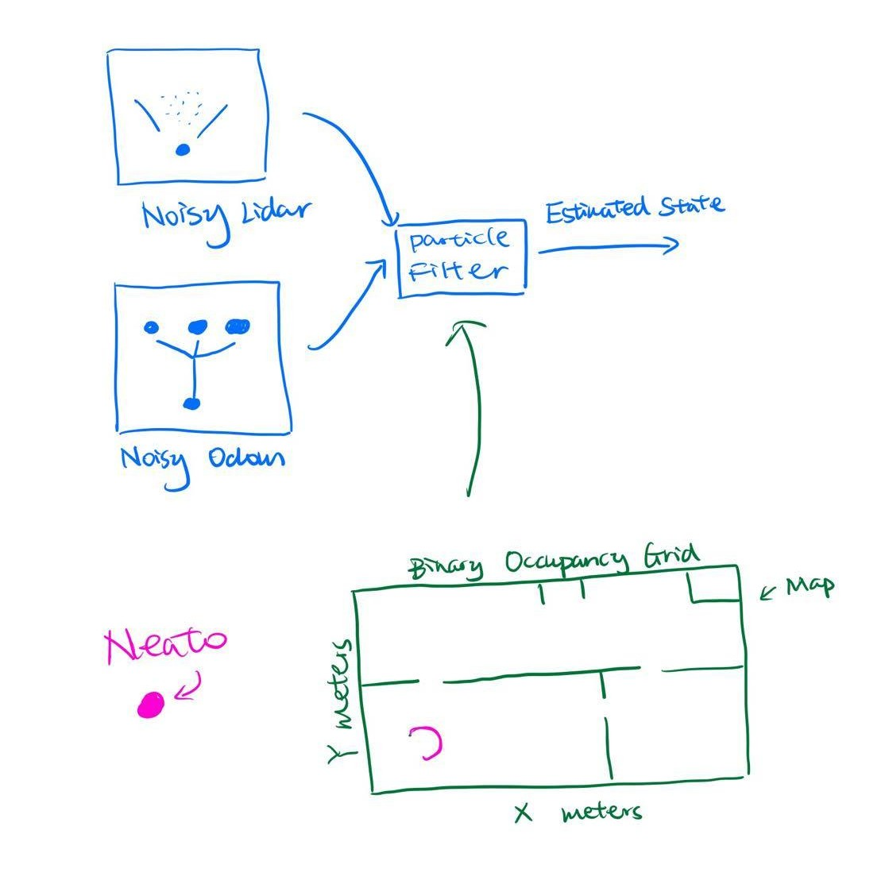
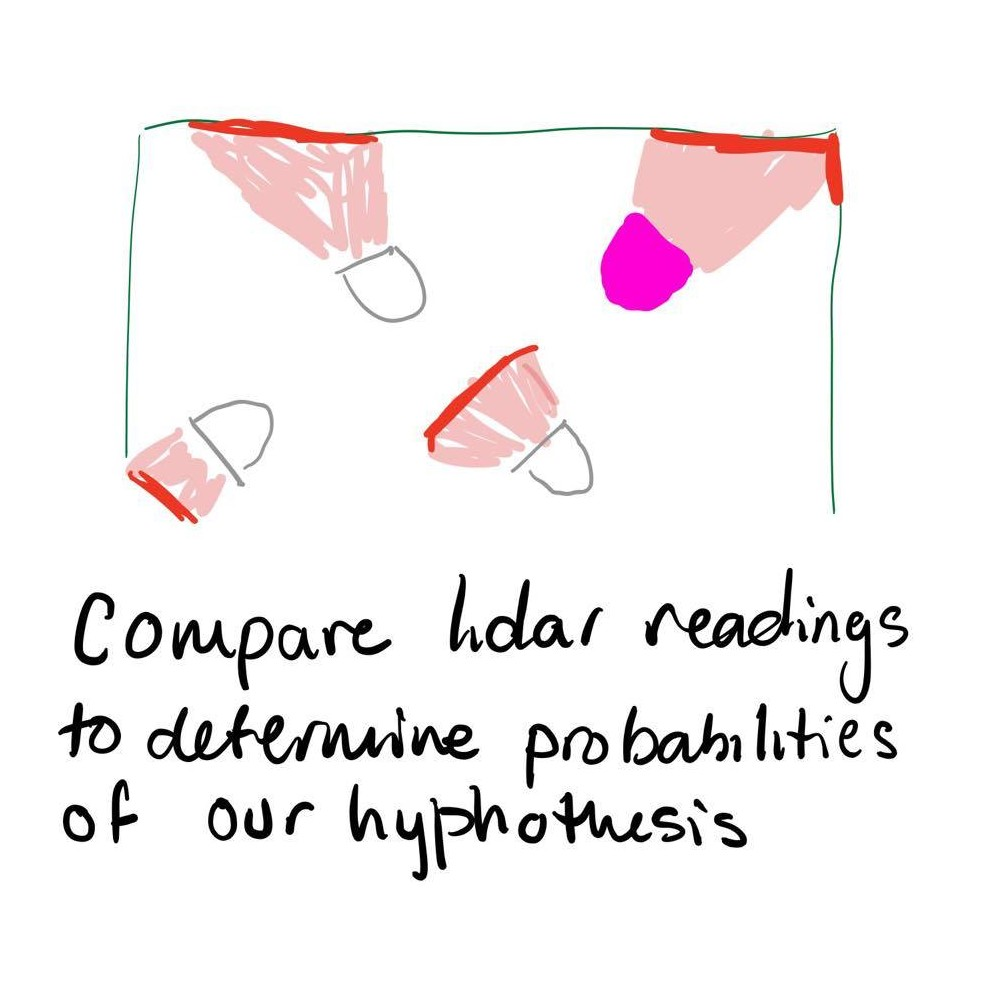

# Implementation Plan

#### CompRobo: Robot Localization
#### Anna Griffin and Sherrie Shen

 

## Particle Filter Key Steps

We have the noisy lidar data and odometry readings from the neato that we can use to try and orient ourself (the robot). To begin, the following is a rough outline of how we are going to go about creating a particle filter. 

1. Generate random particles around the map (hypotheses)
2. Choose a particle and determine what the robot would sense if it were in that position. Using that information, calculate the likelihood that it is the position of the actual robot by comparing the estimate and real data. 
3. Assign a weight to the particle depending on the likelihood calculated and its probability of being the robot's position.  
4. Repeat these steps for all of the hypotheses so that they are all weighted according to how probable it is that it is in the same position as the actual robot.
5. Resample the particles but take their weights into account so that the ones with more weight are more influential. 
6. Move the robot and keep track of the velocity and time to calculate the distance that it has traveled. (random speed)
7. Transform each particle in the same way and remeasure their estimates using the lidar sensor
8. Continue resampling and weighing the weights the particles until you have a reasonable hypothesis.

## Testing Implementation Ideas
We plan to design tests that are able to test different functionaries to make it easier to debug and identify errors. We will need to test our generation and regeneration of hypotheses. Since the weights are taken into account, a test to make sure that we are strategically generating the new points depending on their respective measurements. Another aspect that we will need to test is the small movement adjustments that we control. We can use a speed or odometry method, but we will want to make sure regardless that we have a reliable way of calculating this transformation. We also predict that there will be a lot of noise to complicate 

## Algorithm/ROS Approach Choice
We have decided that we would like to use the `pf_scaffold.py` starter code to focus more on implementing the algorithm and less on ROS interactions. This fits both of our learning goals for this course. We think this option will give us an opportunity to really dive deep into particle filtering and the math and logic behind it. 

## Questions and Uncertainties 
* How do we get the hypothetical data from the pose estimates?
* What method are we going to use to assign the weights to the particles?
* What are some important edge cases that are important to handle and account for?
* What is the threshold for a "correct" guess of the robots position?
* Will there be things that we optimize for even if it comes at the cost of a different component? How will we make those decisions? 
* Unsure about the resampling step and how to approach it

## Preliminary Diagrams

<table><tr>
<td>  </td>
<td>  </td>
</tr></table>